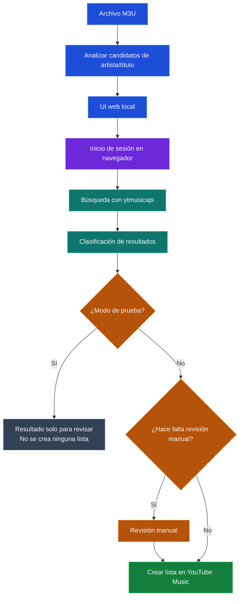

# El Exportador

[English](README.md)

El Exportador convierte listas de reproducción `.m3u` en listas de YouTube Music mediante una aplicación web local.

## Funciones

- Subí una lista `.m3u` y creá la lista correspondiente en YouTube Music.
- Empezá en Modo de prueba para revisar pistas coincidentes, no encontradas y ambiguas sin crear una lista; desactivalo solo cuando quieras crearla.
- Revisá manualmente las pistas no encontradas o ambiguas antes de agregar selecciones a una lista creada sin modo de prueba.

> Spotify no está disponible temporalmente en esta versión. El flujo público de la aplicación solo muestra YouTube Music como destino.

## Requisitos

- Node.js 20 o posterior y npm (incluido con Node.js) para ejecutar desde código fuente y para la app portátil de Windows generada.
- Se recomienda Python 3.11.8 para ejecutar desde código fuente, y es necesario para crear el ZIP portátil de Windows.

## Elegí tu instalación

Elegí el camino según el resultado que buscás; el repositorio verifica la creación de un ZIP portátil para Windows, pero este README no asume que exista un archivo de release descargable.

### Crear y ejecutar el portátil de Windows

Usá este camino si querés un ZIP de Windows que arranque desde `start.cmd` y use un backend de búsqueda de YouTube Music empaquetado.

```powershell
git clone https://github.com/Dortecx/El-Exportador.git
cd El-Exportador
npm run build:portable:win
```

Creá este ZIP en Windows con Node.js 20 o posterior, Python 3 con los requisitos Python fijados, y PyInstaller disponible para el `python` seleccionado. El ZIP generado en `portable-win\El-Exportador-<version>-windows.zip` incluye `artifacts\searcher.exe`; cuando lo descomprimís y ejecutás `start.cmd`, la app portátil no usa ni requiere `.venv`. `start.cmd` apunta la app al backend empaquetado mediante `M3U_YTMUSIC_SEARCHER`, así que ejecuta `artifacts\searcher.exe` en vez de un entorno Python de código fuente. Para ejecutar el ZIP también necesitás Node.js 20 o posterior y un navegador de Windows compatible con Chromium para iniciar sesión en YouTube Music.

### Código fuente en Windows

Usá este camino si querés ejecutar la app directamente desde el repositorio en Windows. Se recomienda `.venv`, pero no es obligatorio: mantiene dependencias Python como `ytmusicapi` aisladas del intérprete del sistema.

Configuración aislada recomendada:

```powershell
git clone https://github.com/Dortecx/El-Exportador.git
cd El-Exportador
py -3 -m venv .venv
.\.venv\Scripts\Activate.ps1
python -m pip install -r requirements.txt
npm ci
npm run web
```

Si no tenés disponible el lanzador de Python, usá `python -m venv .venv` en lugar de `py -3 -m venv .venv`. Si no querés usar `.venv`, instalá los requisitos en el Python seleccionado con `py -3 -m pip install -r requirements.txt` (o `python -m pip install -r requirements.txt`), y después ejecutá los mismos comandos `npm ci` y `npm run web`.

### Código fuente en WSL/Linux

Usá este camino si querés ejecutar la app desde un checkout de código fuente en WSL o Linux.

```bash
git clone https://github.com/Dortecx/El-Exportador.git
cd El-Exportador
python3 -m venv .venv
. .venv/bin/activate
python -m pip install -r requirements.txt
npm ci
npm run web
```

WSL/Linux necesita un navegador nativo compatible con Chromium en el PATH de Linux solo para el inicio guiado de sesión en YouTube Music. En WSL, además necesitás WSLg u otra sesión gráfica Linux para mostrar esa ventana del navegador.

Los ejemplos de código fuente usan `.venv` para aislar dependencias Python como `ytmusicapi` del intérprete del sistema. Después de instalar los requisitos, `npm run web` usa automáticamente el `.venv` del proyecto solo si ese directorio existe; si no, usa la resolución normal de Python. Definí `M3U_YTMUSIC_PYTHON` solo como override avanzado si necesitás una ruta de intérprete personalizada. Abrí `http://localhost:3000` cuando se inicie el servidor.

## Cómo funciona

El Exportador corre como una aplicación web local que te guía desde la carga del archivo hasta la creación de la lista.



**Inicio de sesión en navegador.** El inicio guiado abre YouTube Music en un perfil de navegador aislado y observa la sesión mediante una conexión local de Chrome DevTools Protocol. Captura solo un subconjunto permitido de metadatos de sesión que necesita el backend Python, y después le pide al backend que valide esos metadatos antes de aceptar la conexión.

**Búsqueda en YouTube Music.** El backend Python recibe candidatos de artista/título desde el M3U analizado, consulta YouTube Music mediante `ytmusicapi` y compara las canciones devueltas con el título y artista pedidos. La confianza de coincidencia y el umbral configurado clasifican las pistas como coincidentes, no encontradas o ambiguas; por eso existe la revisión manual.

| Resultado | Qué significa | Acción del usuario |
|-----------|---------------|--------------------|
| Coincidente | Se encontró una coincidencia confiable en YouTube Music. | Mantenela seleccionada, o deseleccionala antes de crear la lista. |
| No encontrada | No se encontró automáticamente una coincidencia utilizable. | Buscá o elegí un reemplazo manualmente, o dejala afuera. |
| Ambigua | Hay varias coincidencias posibles, o la confianza no alcanza para elegir una sola. | Revisá las opciones y elegí la pista correcta. |

El Modo de prueba hace la búsqueda y clasificación sin crear una lista. Cuando lo desactivás, El Exportador crea la lista de YouTube Music con las selecciones coincidentes, mientras la revisión manual resuelve las pistas pendientes.

Privacidad/localidad: El Exportador analiza el archivo M3U localmente y usa la autenticación/comunicación con la API de YouTube Music solo para buscar y crear listas en tu cuenta.

## Uso

1. Subí un archivo `.m3u` en la aplicación local.

   

2. Iniciá la conversión y consultá su progreso.

   

3. Resuelve las pistas no encontradas o ambiguas cuando se solicite.

   

4. Buscá la lista creada en YouTube Music.

   

YouTube Music usa el inicio de sesión guiado del navegador y su autenticación específica; la privacidad de sus listas sigue el comportamiento de la cuenta/API de YouTube Music.

## Compatibilidad de plataforma

El Exportador es compatible con Windows. El uso nativo en WSL/Linux es experimental y requiere Python 3 más un navegador Linux compatible con Chromium (`google-chrome`, `chromium`, Brave o Microsoft Edge) disponible en el PATH de Linux para el inicio guiado en YouTube Music. La interoperabilidad desde WSL con navegadores `.exe` de Windows no está soportada en esta etapa.

## Licencia

Este proyecto se distribuye bajo la licencia MIT.
