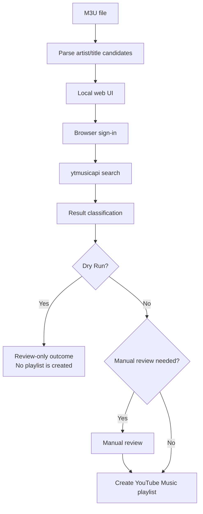

# El Exportador

[Español](README.es.md)

El Exportador converts `.m3u` playlists into YouTube Music playlists through a local web application.

## Features

- Upload an `.m3u` playlist and create a matching YouTube Music playlist.
- Start in Dry Run Mode to review matched, unmatched, and ambiguous tracks without creating a playlist; turn it off only when ready to create one.
- Review unmatched or ambiguous tracks manually before adding selected tracks to a non-dry-run playlist.

> Spotify is temporarily unavailable in this release. The public app flow only shows YouTube Music as the destination.

## Requirements

- Node.js 20 or later and npm (included with Node.js) for source checkouts and the generated Windows portable app.
- Python 3.11.8 is recommended for source checkouts and required when building the Windows portable ZIP.

## Choose your setup

Pick the path that matches the outcome you want; the repository verifies building a Windows portable ZIP, but this README does not assume a downloadable release archive exists.

### Windows portable build/run

Use this when you want a Windows ZIP that starts from `start.cmd` and uses a packaged YouTube Music search backend.

```powershell
git clone https://github.com/Dortecx/El-Exportador.git
cd El-Exportador
npm run build:portable:win
```

Build this ZIP on Windows with Node.js 20 or later, Python 3 with the locked Python requirements, and PyInstaller available to the selected `python`. The generated `portable-win\El-Exportador-<version>-windows.zip` includes `artifacts\searcher.exe`; when you unzip it and run `start.cmd`, the app uses that packaged backend through `M3U_YTMUSIC_SEARCHER` instead of a source `.venv`. Running the ZIP still requires Node.js 20 or later and a supported Windows Chromium-compatible browser for YouTube Music sign-in.

### Windows source checkout

Use this when you want to run the app directly from the repository on Windows.

```powershell
git clone https://github.com/Dortecx/El-Exportador.git
cd El-Exportador
py -3 -m venv .venv
.\.venv\Scripts\Activate.ps1
python -m pip install -r requirements.txt
npm ci
npm run web
```

If the Python launcher is unavailable, use `python -m venv .venv` instead of `py -3 -m venv .venv`.

### WSL/Linux source checkout

Use this when you want to run the app from a WSL or Linux source checkout.

```bash
git clone https://github.com/Dortecx/El-Exportador.git
cd El-Exportador
python3 -m venv .venv
. .venv/bin/activate
python -m pip install -r requirements.txt
npm ci
npm run web
```

WSL/Linux needs a native Chromium-compatible browser on the Linux PATH only for guided YouTube Music browser sign-in. In WSL, WSLg or another graphical Linux session is also required to display that browser window.

Source checkout paths create `.venv` so Python dependencies such as `ytmusicapi` stay isolated from the system interpreter. After requirements are installed, `npm run web` automatically uses the project `.venv`; set `M3U_YTMUSIC_PYTHON` only as an advanced override when you need a custom interpreter path. Open `http://localhost:3000` after the server starts.

## How it works

El Exportador runs as a local web app that guides the conversion from file upload to playlist creation.



**Browser sign-in.** Guided auth opens YouTube Music in an isolated browser profile and observes the session through a local Chrome DevTools Protocol binding. It captures only an allowlisted subset of session metadata needed by the Python backend, then asks the backend to validate that metadata before accepting the connection.

**YouTube Music search.** The Python backend receives artist/title candidates from the parsed M3U file, queries YouTube Music through `ytmusicapi`, and compares returned song candidates against the requested title and artist. Match confidence and the configured threshold classify tracks as matched, unmatched, or ambiguous, which is why manual review exists.

| Result | Meaning | User action |
|--------|---------|-------------|
| Matched | A confident YouTube Music match was found. | Keep it selected, or deselect it before creating the playlist. |
| Unmatched | No usable match was found automatically. | Search or select a replacement manually, or leave it out. |
| Ambiguous | Multiple or uncertain matches need confirmation. | Review the choices and pick the correct track. |

Dry Run performs lookup and classification without creating a playlist. When Dry Run is off, El Exportador creates the YouTube Music playlist from the matched selections, while manual review handles unresolved tracks.

Privacy/locality: El Exportador parses the M3U file locally and uses YouTube Music authentication/API communication only to search and create playlists in your account.

## Usage

1. Upload an `.m3u` file in the local application.

   

2. Start the conversion and follow its progress.

   

3. Resolve any unmatched or ambiguous tracks when prompted.

   

4. Find the created playlist in YouTube Music.

   

YouTube Music uses guided browser sign-in and destination-specific authentication; playlist privacy follows the YouTube Music account/API behavior.

## Platform support

El Exportador is supported on Windows. Native WSL/Linux use is experimental and requires Python 3 plus an installed Chromium-compatible Linux browser (`google-chrome`, `chromium`, Brave, or Microsoft Edge) available on the Linux PATH for guided YouTube Music sign-in. WSL-to-Windows browser `.exe` interop is not supported in this stage.

## License

This project is licensed under the MIT License.
