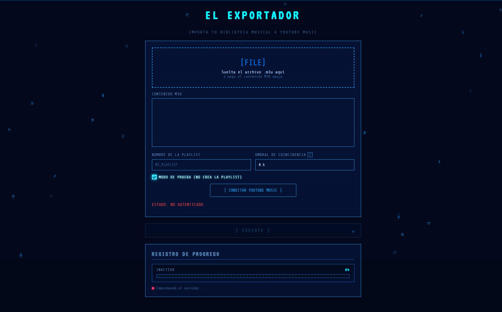
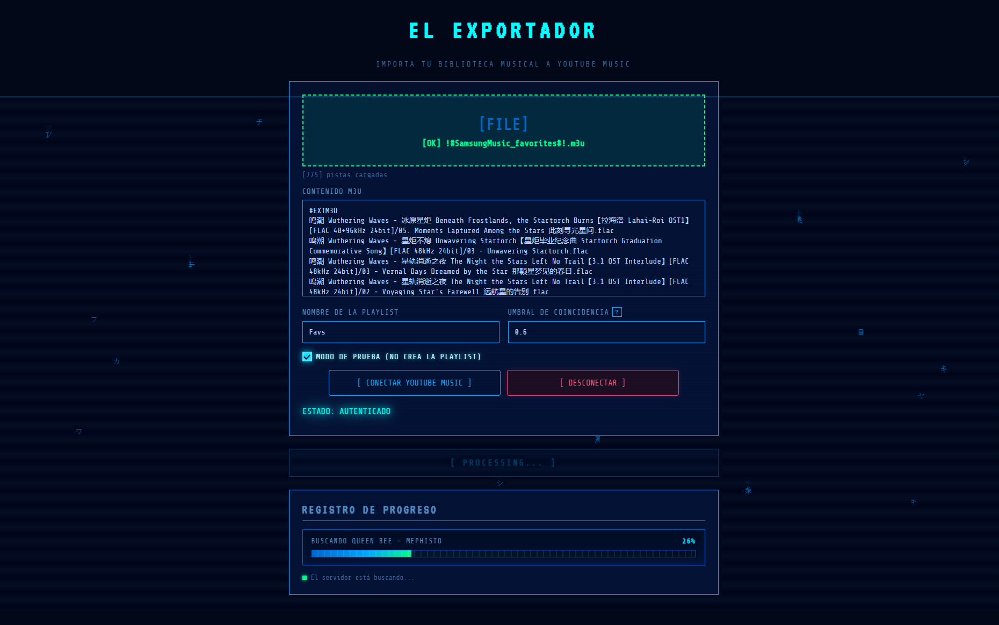
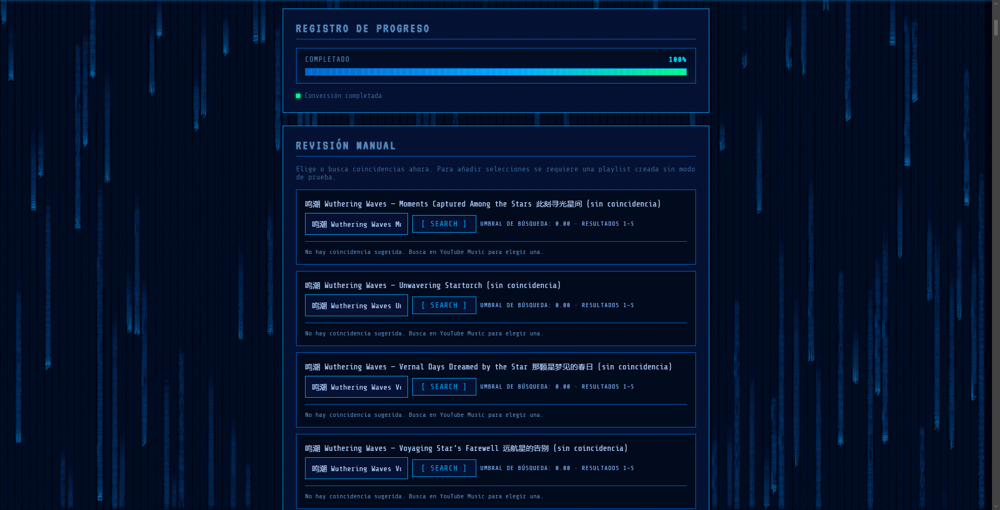
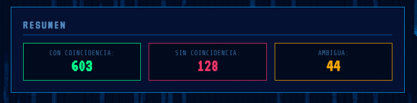

# El Exportador

[English](README.md)

El Exportador convierte listas de reproducción `.m3u` en listas de reproducción de YouTube Music mediante una aplicación web local.

## Funciones

- Sube una lista `.m3u` y crea la lista correspondiente en YouTube Music.
- Consulta el progreso de la conversión en el navegador.
- Usa la autenticación guiada en el navegador en configuraciones de Windows compatibles.

## Requisitos

- Node.js 20 o posterior.
- Se recomienda Python 3.11.8.
- npm (incluido con Node.js).

## Inicio rápido local

```bash
git clone https://github.com/Dortecx/El-Exportador.git
cd el-exportador
pip install -r requirements.txt
npm ci
npm run web
```

Se prefiere `npm ci` porque instala las dependencias fijadas en `package-lock.json`. Abre `http://localhost:3000` cuando se inicie el servidor.

## Uso y autenticación

1. En la aplicación local, autentícate con YouTube Music cuando se solicite y sube un archivo `.m3u`.

   

2. Inicia la conversión y consulta su progreso.

   

3. Resuelve las pistas no encontradas o ambiguas cuando se solicite.

   

4. Busca la lista creada en YouTube Music.

   

La autenticación guiada mediante navegador solo está disponible en Windows. No funciona en macOS, Linux ni WSL.

## Aplicación portátil para Windows

Crea el ZIP portátil para Windows desde Windows:

```powershell
npm run build:portable:win
```

Para crear el ZIP portátil se requiere Windows, Node.js 20 o posterior y Python 3.11.8 con PyInstaller. Para ejecutar el ZIP se requiere Node.js 20 o posterior y un navegador Chromium compatible para la autenticación guiada. WSL no puede usar la autenticación guiada ni crear la aplicación portátil para Windows.

## Limitaciones de plataforma

El servidor local puede ejecutarse donde sus dependencias sean compatibles, pero la autenticación guiada mediante navegador es exclusiva de Windows. Las plataformas que no son Windows y WSL no disponen de una alternativa de inicio de sesión guiado en este proyecto.

## Licencia

Este proyecto se distribuye bajo la licencia MIT.
